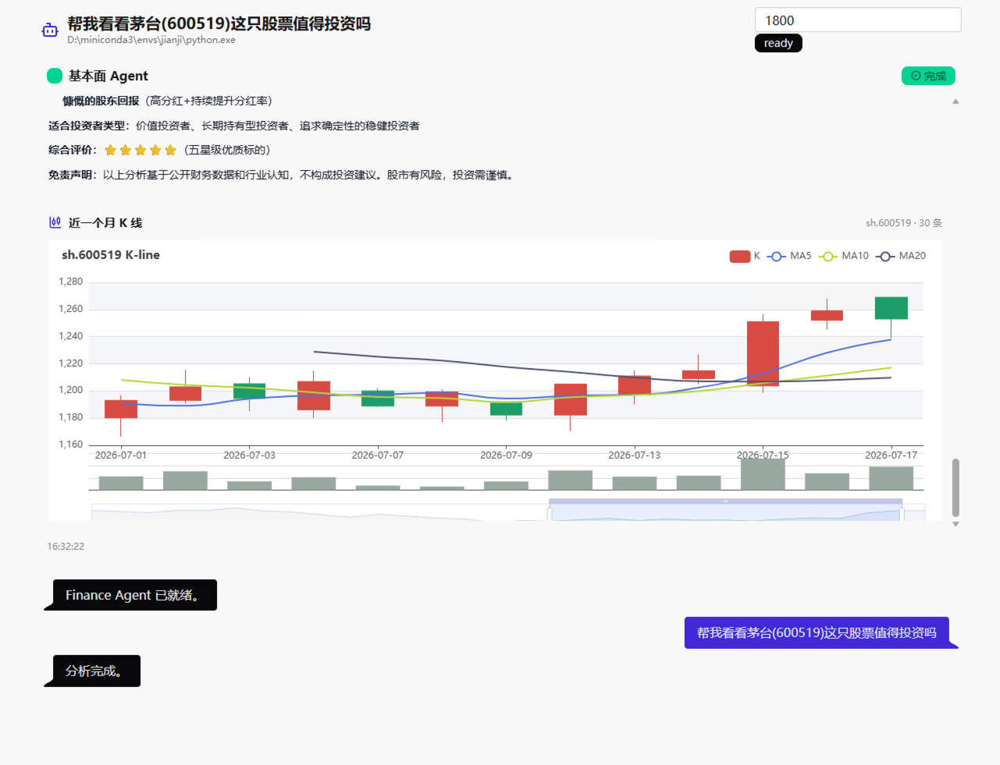

# Finance Agent

**一个面向 A 股研究的多 Agent 投资分析工作台。**



Finance Agent 试图把投研工作里最耗耐心的部分交给 Agent：从公开市场数据中抽取线索，调用 MCP 工具完成财务、行情与新闻检索，再把分析过程和最终报告以对话式界面呈现出来。

它不是一个简单的“问答 Demo”，而是一个正在演进中的智能投研控制台：后端负责调度 LangGraph/ReAct Agent 与数据工具，前端负责把工具调用、流式正文、K 线图和多轮对话体验组织成一个可观察、可迭代、可继续扩展的研究工作流。

## 更新日志

### 2026/6/21

* 初步测试项目。
* 将现有仓库推送到远程仓库。

### 2026/6/23

排查发现，每个 Agent 自身的 ReAct 循环存在问题。

LangGraph 默认递归限制为 25 步。通过打印工具调用流程日志，确认出现 `recursion limit` 错误主要有两个原因：

1. 转换内容为 Markdown 文档的工具未下载，导致工具调用报错。
2. Agent 一次会调用多个工具，而这些工具可能触发 Baostock 的并发登录限制，导致部分工具无法正常 login。

同时，提示词中要求 Agent “需要使用不同工具进行组合”，因此 Agent 会持续尝试调用多个工具，最终更容易触发递归步数限制。

### 2026/6/30

开始使用 `uv` 管理项目依赖。

### 2026/7/21

新增 `vue` 前后端调试控制台，用于在网页端调试 Finance Agent 的单 Agent 流式输出流程。

* 前端使用 Vue、Vite、DaisyUI 构建对话式页面，包含左侧会话边栏、底部输入框和基本面 Agent 输出区。
* 后端使用 FastAPI 提供接口，通过 SSE 将基本面 Agent 的工具调用进度和最终 Markdown 分析内容流式推送到前端。
* 新增基本面 Agent 单独运行入口，便于前端优先调试单 Agent 链路。
* 新增近一个月 K 线展示模块，前端使用 ECharts 渲染后端返回的 K 线数据。
* 新增 Agent 正文回复框和复制按钮，方便复制单次分析结果。
* 新增基本面 Agent 的轻量会话记忆，当前使用 Python 进程内数组保存最近对话，用于支持初步多轮追问。
* 完善 README 首页展示，新增前端截图和项目介绍。

## 使用 uv 安装项目依赖

克隆项目后，进入项目根目录：

```bash
cd stock-agent
```

创建虚拟环境：

```bash
uv venv
```

激活虚拟环境：

```bash
source .venv/bin/activate
```

使用 `uv` 安装依赖：

```bash
uv pip install -r requirements.txt
```
## 运行项目
复制 `.env` 文件
```bash
cd stock-agent/Financial-MCP-Agent
cp .env.example .env
```

将 `.env`文件中的 key 和 url 换成个人的 key 和 url,以及使用的模型。

修改 mcp-tools的路径：
在 ` stock-agent/Financial-MCP-Agent/src/tools/mcp_config.py`下:
 ` r"/Users/mac/Finance/stock-agent/a-share-mcp-is-just-i-need"`,  

模块化运行基本面agent测试：
```bash
cd Financial-MCP-Agent
python -m src.agents.fundamental_agent
```
windows下运行所有agent测试:
```bash
cd Financial-MCP-Agent
python -m src.main --command "帮我看看茅台(600519)这只股票值得投资吗"
```
